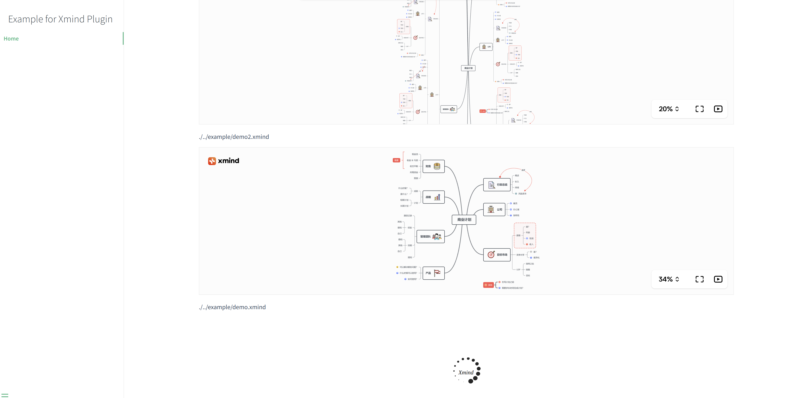

# Docsify Xmind 💻

> Plugin for [Docsify](https://docsify.js.org/#/) 📘 that adds a preview of your xmind file

**Key Features**

-   A live preview of your xmind fiile

[Demo online](https://anthubtc.github.io/docBuildMethod/#/docsifyXmind)

This is my first plugin - please feel welcome to suggest features or raise bugs by creating an issue.

## Installation

1. Add the jsdelivr script

```html
<script src="//cdn.jsdelivr.net/gh/AntHubTC/docsify-xmind@1.0/example/dist/index.min.js></script>
```

2. Add the jsdelivr style

```html
<link rel="stylesheet" href="//cdn.jsdelivr.net/gh/AntHubTC/docsify-xmind@1.0/example/dist/index.min.css" />
```


3. Use the following markdown to add a component to your documentation

````text
```xmind preview
./../example/demo.xmind  <- file path
```
````

4. This is what it should look like



## Example

To see the small example in this repo, run the following.

```bash
git clone https://github.com/Anthubtc/docsify-xmind
cd docsify-xmind
yarn install
yarn build
yarn serve
```

## License

This plugin uses the MIT License, [summarised here](https://tldrlegal.com/license/mit-license).
